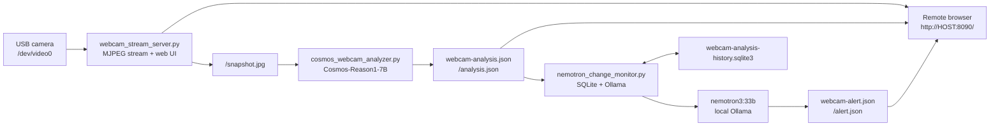

# Webcam AI Monitoring App

This repo includes a local webcam monitoring solution that streams a USB camera to a browser, analyzes short clips with NVIDIA Cosmos-Reason, and uses a local Nemotron model through Ollama to detect material changes in the scene.

## Architecture



## Files

Main Python scripts:

- `scripts/webcam_stream_server.py` - captures `/dev/video0`, serves the MJPEG stream, and displays the dashboard.
- `scripts/cosmos_webcam_analyzer.py` - samples short clips from `/snapshot.jpg` and analyzes them with `nvidia/Cosmos-Reason1-7B`.
- `scripts/nemotron_change_monitor.py` - stores recent Cosmos summaries in SQLite and asks local Ollama/Nemotron whether the newest summary is materially different.

Runtime outputs:

- `webcam-analysis.json` - latest Cosmos analysis.
- `webcam-alert.json` - latest Nemotron change decision.
- `webcam-analysis-history.sqlite3` - recent analysis and alert history.
- `webcam-analysis-clips/latest.mp4` - latest sampled clip sent to Cosmos.
- `webcam-stream.log`, `webcam-analysis.log`, `webcam-alert.log` - service logs.
- `webcam-stream.pid`, `webcam-analysis.pid`, `webcam-alert.pid` - service process IDs.

## Prerequisites

Run from the repo root:

```bash
cd /home/anslutsky/Dev/Cosmos-transfer
```

Required system tools:

```bash
command -v ffmpeg
command -v ollama
```

Required camera device:

```bash
lsusb
ls -l /dev/video* /dev/v4l/by-id/* 2>/dev/null
```

The current setup uses the NexiGo USB webcam at `/dev/video0`.

Required Python environment:

```bash
.venv/bin/python - <<'PY'
import torch, transformers, qwen_vl_utils
print("torch", torch.__version__)
print("cuda", torch.cuda.is_available())
PY
```

Required local Cosmos model cache:

```bash
find -L .cache/huggingface/hub/models--nvidia--Cosmos-Reason1-7B/snapshots \
  -maxdepth 2 -name 'model-*.safetensors' | head
```

Required local Nemotron model through Ollama:

```bash
ollama list | grep -i nemotron
```

The current solution uses:

```text
nemotron3:33b
```

## Run In The Foreground

Use foreground mode when testing one component at a time.

Start the webcam web server:

```bash
scripts/webcam_stream_server.py \
  --device /dev/video0 \
  --host 0.0.0.0 \
  --port 8090 \
  --video-size 1280x720 \
  --fps 15 \
  --analysis-path /home/anslutsky/Dev/Cosmos-transfer/webcam-analysis.json \
  --alert-path /home/anslutsky/Dev/Cosmos-transfer/webcam-alert.json
```

In another terminal, start Cosmos analysis:

```bash
HF_HOME=/home/anslutsky/Dev/Cosmos-transfer/.cache/huggingface \
TRANSFORMERS_OFFLINE=1 \
.venv/bin/python scripts/cosmos_webcam_analyzer.py \
  --device-map cuda \
  --clip-seconds 2 \
  --sample-fps 1 \
  --model-video-fps 1 \
  --max-pixels 230400 \
  --max-new-tokens 120 \
  --loop-delay 1
```

In a third terminal, start Nemotron change monitoring:

```bash
scripts/nemotron_change_monitor.py \
  --model nemotron3:33b \
  --interval 4 \
  --history-limit 8 \
  --min-history 2 \
  --timeout 240
```

## Run In The Background

Start all three services:

```bash
cd /home/anslutsky/Dev/Cosmos-transfer

setsid -f scripts/webcam_stream_server.py \
  --device /dev/video0 \
  --host 0.0.0.0 \
  --port 8090 \
  --video-size 1280x720 \
  --fps 15 \
  --analysis-path /home/anslutsky/Dev/Cosmos-transfer/webcam-analysis.json \
  --alert-path /home/anslutsky/Dev/Cosmos-transfer/webcam-alert.json \
  > webcam-stream.log 2>&1 < /dev/null
ps -eo pid,cmd | awk '/scripts\/webcam_stream_server.py/ && !/awk/ {print $1; exit}' > webcam-stream.pid

setsid -f env \
  HF_HOME=/home/anslutsky/Dev/Cosmos-transfer/.cache/huggingface \
  TRANSFORMERS_OFFLINE=1 \
  /home/anslutsky/Dev/Cosmos-transfer/.venv/bin/python \
  /home/anslutsky/Dev/Cosmos-transfer/scripts/cosmos_webcam_analyzer.py \
  --device-map cuda \
  --clip-seconds 2 \
  --sample-fps 1 \
  --model-video-fps 1 \
  --max-pixels 230400 \
  --max-new-tokens 120 \
  --loop-delay 1 \
  > webcam-analysis.log 2>&1 < /dev/null
ps -eo pid,cmd | awk '/scripts\/cosmos_webcam_analyzer.py/ && !/awk/ {print $1; exit}' > webcam-analysis.pid

setsid -f scripts/nemotron_change_monitor.py \
  --model nemotron3:33b \
  --interval 4 \
  --history-limit 8 \
  --min-history 2 \
  --timeout 240 \
  > webcam-alert.log 2>&1 < /dev/null
ps -eo pid,cmd | awk '/scripts\/nemotron_change_monitor.py/ && !/awk/ {print $1; exit}' > webcam-alert.pid
```

Open the dashboard from another machine on the same network:

```text
http://192.168.1.192:8090/
```

Use the current host IP if it changes:

```bash
hostname -I
```

## Endpoints

- Dashboard: `http://HOST:8090/`
- Live stream: `http://HOST:8090/stream.mjpg`
- Snapshot: `http://HOST:8090/snapshot.jpg`
- Stream health: `http://HOST:8090/healthz`
- Cosmos analysis JSON: `http://HOST:8090/analysis.json`
- Nemotron alert JSON: `http://HOST:8090/alert.json`

## Verify

Check service status:

```bash
ps -p "$(cat webcam-stream.pid)" -o pid,stat,etime,cmd
ps -p "$(cat webcam-analysis.pid)" -o pid,stat,etime,cmd
ps -p "$(cat webcam-alert.pid)" -o pid,stat,etime,cmd
```

Check outputs:

```bash
curl -sS http://127.0.0.1:8090/healthz
curl -sS http://127.0.0.1:8090/analysis.json
curl -sS http://127.0.0.1:8090/alert.json
```

Inspect history:

```bash
.venv/bin/python - <<'PY'
import sqlite3
conn = sqlite3.connect("webcam-analysis-history.sqlite3")
print("analyses", conn.execute("select count(*) from analyses").fetchone()[0])
print("alerts", conn.execute("select count(*) from alerts").fetchone()[0])
for row in conn.execute("select id, alert, severity, confidence, description from alerts order by id desc limit 5"):
    print(row)
PY
```

## Stop

Stop the three background services:

```bash
kill "$(cat webcam-alert.pid)"
kill "$(cat webcam-analysis.pid)"
kill "$(cat webcam-stream.pid)"
```

If a PID file is stale, find and stop processes manually:

```bash
ps -eo pid,cmd | grep -E 'webcam_stream_server|cosmos_webcam_analyzer|nemotron_change_monitor'
```

## Troubleshooting

Camera is missing:

```bash
ls -l /dev/video* /dev/v4l/by-id/* 2>/dev/null
```

Port is already in use:

```bash
ss -ltnp 'sport = :8090'
```

Cosmos model does not load:

- Confirm `TRANSFORMERS_OFFLINE=1` is set only when the local cache exists.
- Confirm `.cache/huggingface/hub/models--nvidia--Cosmos-Reason1-7B` contains safetensor shards.
- Check `webcam-analysis.log`.

Nemotron monitor does not respond:

```bash
ollama ps
ollama list | grep -i nemotron
cat webcam-alert.log
```

The current Ollama `nemotron3:33b` model may return structured output in the `thinking` field; `nemotron_change_monitor.py` handles both `response` and `thinking`.

## Security Note

The dashboard is plain unauthenticated HTTP bound to `0.0.0.0`. Keep it on a trusted LAN or VPN, or add authentication/reverse-proxy access control before exposing it outside the local network.
