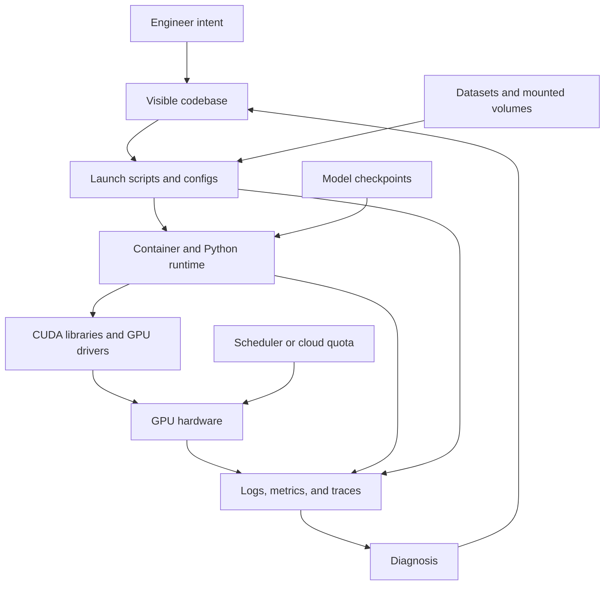

# AI Harnesses for GPU-Accelerated Infrastructure

Working draft for a blog post about a new way of working with AI-assisted development tools and GPU-heavy systems.

## Draft Status

* Audience: engineers, ML infrastructure owners, and technical leads who run GPU workloads.
* Goal: explain how AI harnesses such as Cursor, Codex Desktop, and similar tools can become operational collaborators for GPU-accelerated projects.
* Core claim: the next productivity leap is not only AI writing code, but AI helping engineers understand, modify, run, debug, and document the infrastructure around expensive compute.
* Tone: practical, grounded, and optimistic without making the harness sound autonomous beyond what teams can safely supervise.

## Working Title Options

* The AI Harness as an Infrastructure Copilot
* Let the Harness Drive the Terminal: Managing GPU Infrastructure with AI
* From Code Suggestions to Compute Stewardship
* A New Operating Model for GPU-Accelerated Engineering

## Thesis

GPU-accelerated projects are no longer just codebases. They are living systems made of CUDA versions, drivers, containers, model checkpoints, datasets, inference scripts, orchestration layers, logs, and cost constraints. Modern AI harnesses sit close enough to the repository, terminal, and developer workflow to help manage that whole surface area.

The important shift is from autocomplete to active collaboration. Instead of asking an assistant to produce isolated snippets, engineers can ask a harness to inspect the repo, trace setup instructions, run validation commands, read failures, propose scoped changes, and preserve the reasoning trail.

## Proposed Outline

1. The old model: humans keep the whole GPU stack in their heads.
2. Why GPU infrastructure is uniquely hard to operate.
3. What an AI harness adds beyond chat.
4. A concrete workflow: setup, verification, inference, debugging, and documentation.
5. Safety boundaries: what the harness should never decide alone.
6. How teams can adopt this style incrementally.
7. The broader shift: infrastructure work becomes more conversational, observable, and reproducible.

## Opening Draft

GPU infrastructure has a strange shape. The code is visible, but the system is distributed across drivers, containers, hardware, package managers, model weights, launch scripts, cloud quotas, and a long tail of assumptions that only reveal themselves when a job fails at 2:00 a.m.



For years, the answer was expertise through repetition. A senior engineer learned which CUDA image matched which driver, which inference flag avoided an out-of-memory error, which setup doc was stale, and which log line meant the cluster was misconfigured instead of the model being broken.

AI harnesses change the feel of that work. These tools are not merely places to ask questions about code. They are increasingly becoming workbenches where the assistant can inspect the repository, run commands, edit files, compare outputs, and keep a coherent thread of intent. That makes them especially useful for GPU-accelerated systems, where progress depends on connecting code-level changes to runtime behavior.

## What Makes GPU Infrastructure Different

GPU systems combine software correctness with environmental correctness. A small mismatch can break the whole workflow:

* The NVIDIA driver may not support the CUDA runtime expected by the container.
* A package lockfile may install a build that lacks the right GPU backend.
* A model checkpoint may be present locally but not mounted inside the container.
* A multi-GPU command may work on one machine but fail under a scheduler.
* A memory error may be caused by resolution, batch size, tokenizer settings, attention backend, or fragmented device memory.

This is where an AI harness can help. It can read the docs, inspect the scripts, identify the likely configuration path, run a lightweight check, and then adjust the next step based on real output.

## From Assistant to Harness

A chat assistant answers from the outside. A harness works from inside the project.

In practice, that means it can:

* Locate setup and inference instructions already present in the repository.
* Compare those instructions against package files, Dockerfiles, and scripts.
* Run diagnostics such as `nvidia-smi`, environment checks, import tests, or dry-run commands.
* Summarize logs and identify the first meaningful failure.
* Patch docs or scripts so the next engineer does not repeat the same investigation.
* Keep a concise record of what changed and why.

That difference matters. The harness is not replacing the infrastructure engineer. It is reducing the amount of context the engineer has to reload before making a good decision.

## Example Workflow

Imagine a team maintaining a GPU-heavy inference repository.

1. The engineer asks the harness to verify the local environment.
2. The harness reads the setup guide, package metadata, Dockerfile, and available scripts.
3. It runs safe inspection commands and reports the detected GPU, driver, CUDA runtime, Python version, and installed extras.
4. It attempts a minimal inference or smoke test.
5. If the run fails, it traces the error back to the most likely layer: dependency, checkpoint, GPU memory, launch command, or application code.
6. It proposes a small fix, applies it with reviewable changes, and reruns the check.
7. It updates the working notes or documentation with the new known-good path.

This is not magic. It is disciplined iteration with a collaborator that can hold more of the operational map in active memory.

## Concrete Example: Installing and Running Cosmos Transfer

One representative AI-harness session is a useful miniature version of this workflow. The task was simple to state but complex to execute: use NVIDIA Cosmos Transfer2.5 to transform a YouTube driving video from rainy Europe into a sunny desert highway, while keeping all work inside one local project folder. After the user supplied the needed access credential and approved the categories of commands the harness could run, the AI handled the rest of the investigation and execution loop without step-by-step human direction.

### Prompt 1: State the Goal and Boundaries

The first prompt does not need to specify CUDA versions, model variants, or every command. It should state the desired outcome, the workspace boundary, and what "done" means.

```text
Use the NVIDIA Cosmos Transfer2.5 project in [WORKSPACE_PATH] to transform this driving video:
[VIDEO_URL]

Goal: change the scene from rainy Europe to a sunny desert highway while preserving the driving perspective, road layout, and camera motion.

Keep all downloads, caches, generated files, and edits inside [WORKSPACE_PATH]. Do not clean up git state or remove files unless I explicitly approve it. Inspect the repository docs and existing assets first, then choose the safest inference path. When finished, give me the generated video path, the comparison video path, logs, and basic media verification.
```

The harness first discovered that the repository was already a Cosmos Transfer checkout, but the working tree had a strange deleted-and-untracked state. Instead of trying to clean up the repository, it treated the files as user-owned workspace state and read the existing docs, scripts, assets, and partial outputs. That one decision mattered: it avoided destructive git cleanup and found an already-downloaded source clip, earlier specs, and failure logs.

### Prompt 2: Ask the Harness to Inspect Before Installing

A good second prompt pushes the assistant toward observation before action. This is especially useful when a repository may already contain a virtualenv, cached checkpoints, old output folders, or partial runs.

```text
Before installing or downloading anything large, inspect the repository and tell me:

1. Which setup and inference docs apply.
2. Whether a virtual environment already exists.
3. Whether source clips, model checkpoints, or partial outputs are already present.
4. What GPU, driver, CUDA runtime, Python version, and package manager state you detect.
5. The smallest viable inference path for a short video test.

Run read-only checks first. If something needs network access, GPU execution, or a large download, explain why and then proceed only if the command is within the approved workspace boundary.
```

The setup then became a multi-layer infrastructure task. The harness read the setup guide and inference docs, found that the machine was an NVIDIA GB10 with driver `580.142`, and selected the CUDA 13 path instead of the default CUDA 12.8 path. It noticed that `uv run` had pulled in CPU-oriented Torch packages, then repaired the local environment with `uv sync --extra=cu130 --no-dev --inexact`, using workspace-local `.uv-cache`, `.tmp`, and Hugging Face cache directories. It verified the result by importing Torch, confirming `torch==2.9.1+cu130`, checking that CUDA was visible, and running a tiny CUDA tensor operation before spending time on a full model run.

### Prompt 3: Let the AI Choose the Practical Model Path

GPU infrastructure work is full of tempting but expensive branches. The prompt should authorize the harness to pick the smallest credible path and explain the tradeoff.

```text
Choose the most practical Cosmos Transfer path for a short proof-of-work run. Prefer a 720p, 16 fps, 93-frame clip if that matches the model's expected workflow. If there are multiple control modes or model variants, pick the one most likely to succeed on this GPU and explain why.

Create any prompt/spec files needed for the run, but keep them small and reviewable. Preserve previous failed logs and write new attempts to fresh output folders.
```

The harness created a narrower edge-only spec for the 93-frame video path instead of using the heavier multi-control setup, because the docs showed that the full model path had high VRAM requirements and the short-clip edge path was the most practical route.

### Prompt 4: Treat Failures as Routing Signals

The run still hit problems. This is where the harness becomes more than a command runner: it reads the failure and chooses the next branch.

```text
If the run fails, do not start over blindly. Read the logs, identify the first meaningful failure, classify it as dependency, checkpoint access, GPU memory, launch configuration, input media, or application code, and then make one scoped change before retrying.

Keep failed output directories intact so we can compare attempts.
```

The first false start was the distilled edge path. The docs suggested it could be faster, but enabling the experimental checkpoint flag caused the registry to import unrelated experimental modules and attempt a gated action-conditioned checkpoint download before the requested edge model could run. The harness read the failure, preserved the failed output directory, and switched to the base edge model path instead of continuing down that unrelated branch.

### Prompt 5: Handle Credentials Without Leaking Them

Gated model repositories are common in GPU workflows. The prompt should tell the harness how to verify access while keeping secrets out of logs, process lists, and generated docs.

```text
This model may require access to a gated checkpoint. If authentication fails, verify whether the token can access the exact model file using the smallest safe probe you can.

Do not print the token. Do not put the token in generated docs, logs, shell history, or command output. If the runtime needs it, configure it in a workspace-local Hugging Face cache or environment variable with restrictive file permissions, then rerun the job.
```

The next failure was authentication. The model download for `nvidia/Cosmos-Transfer2.5-2B` returned "Access denied" even though the user had provided a Hugging Face token. The harness tested access with a small API probe, confirmed that the token could reach the needed file, then diagnosed the real issue: the inference subprocess and the `hf` downloader were not seeing the token. It wrote the token into a workspace-local Hugging Face cache with restrictive `0600` permissions and reran the job with that cache and token environment wired in. The blog version should never print the token itself; the important part is the pattern of verifying credential scope and then making the runtime inherit it safely.

### Prompt 6: Check GPU Contention Before the Expensive Run

GPU jobs can fail simply because something else is already sitting on the device. The reader can ask the harness to treat GPU ownership as part of the setup.

```text
Before launching the full inference job, check GPU memory and active GPU processes. If another service is holding significant VRAM, identify what it is and whether it is managed by a supervisor or container.

Do not kill unrelated services without approval. If an approved service must be stopped for the run, verify that it stays stopped, then monitor GPU ownership while the job is running.
```

The third issue was GPU contention. A NIM/vLLM service serving `nvidia/cosmos-reason2-8b` was occupying roughly 96 GB of VRAM and restarting when its process was killed. The harness traced the process tree, identified the backing Docker container, checked container status, waited until it was not running, and only then launched Cosmos Transfer. During generation it kept checking that Cosmos was the only heavy GPU owner, using about 53 GB of VRAM at high utilization.

### Prompt 7: Monitor, Verify, and Package the Result

The final prompt turns a long-running command into a complete result instead of a half-finished terminal session.

```text
Run the selected Cosmos Transfer job. Monitor logs and GPU state until the process exits. If progress is quiet, check whether downloads, cache files, or sampler steps are moving before assuming it is stuck.

When it completes, verify the generated media with ffprobe or an equivalent tool. If the model writes a side-by-side comparison video, also create a generated-only output. Report the final paths, duration, resolution, frame rate, frame count, and log location.
```

Once the environment stabilized, the harness ran the full job and monitored it through the long quiet sections. It watched Hugging Face/Xet checkpoint downloads by checking cache growth, saw the gated edge checkpoint progress from hundreds of megabytes to several gigabytes, observed the sampler complete `35/35` steps at roughly 61 seconds per step, and verified the resulting media. The final artifacts included a side-by-side MP4, an edge-control MP4, and a generated-only crop, all verified as a 5.81 second, 16 fps, 720p, 93-frame clip.

This is a good example of the new operating model, and it is not specific to one AI product. Any sufficiently capable harness with repository access, terminal access, command output visibility, and a reviewable edit loop could follow the same pattern. The user did not have to know which CUDA extra to choose, why Torch had changed, which checkpoint path was gated, why the token was not inherited by a subprocess, why the GPU looked full, or how to crop the model's comparison output. The harness moved through those layers by reading the repository, running diagnostics, preserving logs, changing only scoped files, and using each failure as a routing signal for the next attempt.

## Practical Use Cases

### Environment Bring-Up

An AI harness can turn setup docs into executable validation. Instead of manually reading every prerequisite, the engineer can ask the harness to verify the machine against the project requirements and produce a short gap list.

### Container and Runtime Drift

GPU projects often drift across Docker images, CUDA variants, Python versions, and package extras. A harness can compare the intended runtime with the current repository state and flag inconsistencies before a long job wastes compute.

### Inference Debugging

When an inference run fails, the useful question is not only "what is the exception?" but "which layer failed?" The harness can correlate stack traces with launch flags, model assets, memory settings, and recent changes.

### Cost and Capacity Awareness

The same workflow can extend to cloud GPU usage. A harness can help summarize which jobs are running, which machines are idle, and which experiments can be scaled down, provided the team exposes those signals through safe command-line tools or dashboards.

### Documentation as an Output of Operations

Every successful debugging session contains knowledge that usually disappears. A harness can convert that session into durable docs: exact commands, known-good configurations, failure signatures, and recovery steps.

## Safety Boundaries

The harness should be powerful, but not unsupervised. Good team practice should keep clear limits:

* Humans approve destructive operations, cloud spend, credential changes, and production deploys.
* The harness should prefer read-only diagnostics before making changes.
* Generated infrastructure changes should be small, reviewable, and tied to observed failures.
* Secrets should stay out of prompts, logs, commits, and shared notes.
* The team should maintain explicit runbooks for high-risk operations.

The goal is not autonomous infrastructure. The goal is supervised leverage.

## Adoption Pattern

Teams do not need to redesign their platform to use this style. A practical path might look like this:

1. Start with repository-local tasks: setup checks, smoke tests, and doc cleanup.
2. Add standard diagnostic scripts with stable output that the harness can interpret.
3. Teach the harness the team's conventions through checked-in docs and runbooks.
4. Gradually expose non-destructive infrastructure views, such as job status and GPU utilization.
5. Keep approval gates around anything that changes spend, availability, or production state.

## Notes to Expand

* Add screenshots or excerpts from the Cosmos Transfer run artifacts once the post moves from draft to publication.
* Decide whether to mention Kubernetes, Slurm, Ray, or cloud-specific GPU platforms.
* Add a short section on auditability: transcripts, diffs, command history, and reproducible runbooks.
* Add a diagram showing the loop: intent -> repo inspection -> command execution -> observation -> patch -> verification -> documentation.
* Add a stronger closing paragraph about how this changes the role of infrastructure engineers.

## Possible Closing

The most interesting AI workflow is not one where the engineer disappears. It is one where the engineer can stay at the level of judgment longer. GPU infrastructure will remain complex, expensive, and full of sharp edges. But with an AI harness inside the development loop, teams can turn more of that complexity into an inspectable conversation, a set of verified commands, and a growing body of operational memory.
