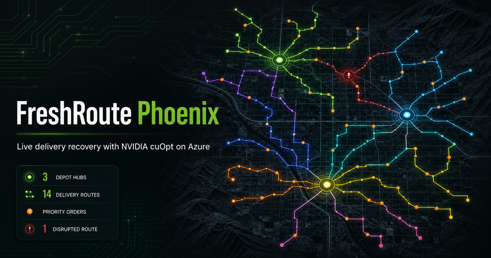

# NVIDIA cuOpt Delivery Recovery on Azure Container Apps

This sample deploys NVIDIA cuOpt to an Azure Container Apps (ACA) serverless
NVIDIA A100 GPU and provides **FreshRoute Phoenix**, a map-first web application
for demonstrating live last-mile delivery recovery.



The application begins with 120 deliveries, 14 vehicles, and three Phoenix-area
depots. At 2:15 PM, 24 priority orders arrive, one EV driver calls out, and
central Phoenix travel times increase. cuOpt rebuilds the complete operating
plan across all 144 orders while enforcing capacities, time windows, driver
rules, route limits, depot assignments, and cold-chain compatibility.

This is a business demonstration and reference integration, not a CPU/GPU
benchmark.

## Security and Cost Notice

The public web application is the only external endpoint. cuOpt uses internal
ACA ingress and is reachable only inside the Container Apps environment. The
deployment script requires either a presenter IP CIDR allowlist or an explicit
acknowledgement that the synthetic demo will be public.

cuOpt defaults to `minReplicas=0` and `maxReplicas=1`. This reduces idle GPU
cost but introduces a cold start on the first solve. The CPU web application
keeps one replica warm. A Premium Azure Container Registry and Azure Maps
account also incur charges independently of GPU usage.

Resources are tagged with `application`, `environment`, and `managedBy` for
Azure Cost Management.

## What the Demo Shows

- **Morning promise:** 120 orders, 14 vehicles, three depots, and a feasible
  route network.
- **Operational shock:** 24 priority orders, one unavailable driver, and a
  deterministic 1.55x central-city traffic factor.
- **Global recovery:** cuOpt simultaneously reassigns and resequences all 144
  deliveries instead of repairing one route at a time.
- **Decision transparency:** the interface exposes fleet data, order windows,
  matrix previews, the exact cuOpt request payload, route utilization, and
  solve timing.
- **Presentation resilience:** a validated recorded solution remains available
  if the live GPU endpoint cannot be reached.

All customer locations are deterministic synthetic latitude/longitude points
around Phoenix-area delivery clusters. No customer or personal data is used.

## Architecture

The deployment runs in three stages:

1. [`main.bicep`](main.bicep) creates Premium ACR, Azure Maps, managed identity,
   RBAC assignments, and an ACA environment with an NC24-A100 workload profile.
2. [`deploy.sh`](deploy.sh) imports the digest-pinned cuOpt image and builds the
   FastAPI/React web image in ACR.
3. [`app.bicep`](app.bicep) deploys private cuOpt and the IP-restricted public
   web application.

The web backend uses its managed identity for short-lived Azure Maps tokens.
It communicates with cuOpt through ACA internal DNS and supports both JSON and
MessagePack responses from the self-hosted cuOpt REST API.

## Prerequisites

- An Azure subscription where ACA serverless A100 GPUs are available
- Serverless A100 GPU quota in the deployment region
- Azure CLI and the Container Apps extension
- Bash 3.2 or later
- Permission to create resource groups, managed identities, role assignments,
  ACR, Azure Maps, and Container Apps resources
- An NVIDIA AI Enterprise license that includes self-hosted NVIDIA cuOpt
- An NGC personal API key with access to the cuOpt container
- Python 3.11 or later and Node.js 22 or later for local development

Creating the `AcrPull` and `Azure Maps Data Reader` assignments requires
`Microsoft.Authorization/roleAssignments/write`.

Review the current platform and product requirements before deployment:

- [ACA serverless GPU regions and quota](https://learn.microsoft.com/azure/container-apps/gpu-serverless-overview)
- [ACA workload profiles](https://learn.microsoft.com/azure/container-apps/workload-profiles-overview)
- [NVIDIA cuOpt installation and container access](https://docs.nvidia.com/cuopt/user-guide/latest/install.html)
- [NVIDIA cuOpt self-hosted REST API](https://docs.nvidia.com/cuopt/user-guide/latest/cuopt-server/client-api/sh-cli-build.html)

## Configure Azure CLI

```bash
az login
az account set --subscription "<SUBSCRIPTION_ID_OR_NAME>"
az extension add --name containerapp --upgrade --allow-preview true
```

## Configure Deployment

Run all commands from this sample directory:

```bash
cd inference/aca/cuopt

export NGC_API_KEY="<YOUR_NGC_PERSONAL_API_KEY>"
export NVIDIA_AI_ENTERPRISE_LICENSE_ACCEPTED="true"
export ACA_GPU_QUOTA_CONFIRMED="true"
```

The confirmation variables are local preflight acknowledgements. They do not
obtain a license or GPU quota.

Restrict the public web app to the presenter or customer network:

```bash
export ALLOWED_IP_CIDR="<PUBLIC_EGRESS_IPV4>/32"
```

You can look up the current public IPv4 address from that network:

```bash
curl -4 --fail --silent --show-error https://api.ipify.org
```

For a short-lived public event using only synthetic data, you may deliberately
omit the CIDR by setting:

```bash
export PUBLIC_DEMO_ACKNOWLEDGED="true"
```

Do not use that setting for production or customer data. Microsoft Entra
authentication can be enabled after deployment when an app registration is
available; see [Container Apps authentication](https://learn.microsoft.com/azure/container-apps/authentication).

Optional deployment settings:

```bash
export LOCATION="eastus"
export RESOURCE_GROUP="rg-freshroute-cuopt-aca"
export NAME_PREFIX="freshroute-cuopt"
export CUOPT_MIN_REPLICAS="0"
export ENABLE_ARTIFACT_STREAMING="false"
```

The source image is pinned to an immutable cuOpt 26.6 manifest digest:

```bash
export CUOPT_SOURCE_IMAGE="nvcr.io/nvidia/cuopt/cuopt@sha256:170215e65abde282a83005f640145e7b5c9af35525e95a096975bb3000f0f94c"
export CUOPT_TARGET_IMAGE="nvidia/cuopt:26.6.0-cuda12.9-py3.14"
```

Before changing the digest, verify the tag in the NGC catalog and repeat the
live solve validation. Do not use `latest` in a reproducible deployment.

## Deploy

```bash
./deploy.sh
```

Before creating resources, the script:

- verifies Azure login and required confirmations
- checks NC24-A100 availability in the selected region
- prints current Container Apps quota information
- refuses unrestricted public ingress without explicit acknowledgement
- uses managed identity for ACR pulls and Azure Maps access

The first environment creation and cuOpt image import can each take several
minutes. Artifact streaming can improve subsequent cold starts, but it is an
Azure preview feature and is disabled by default. Enable it explicitly after
confirming preview support in the target subscription.

## Run the Seller Demo

Open the HTTPS URL printed by `deploy.sh`. The presentation has five beats:

1. **Promise:** explain that every map line is an executable morning route.
2. **Complexity:** open **How this decision was made** and show the connected
   capacity, timing, depot, break, and cold-chain constraints.
3. **Shock:** click **Apply the disruption** and pause on the priority orders,
   unavailable route, congestion, and at-risk deliveries.
4. **Decision:** click **Recover the plan with cuOpt** and distinguish GPU wake
   time from the solver time.
5. **Outcome:** inspect recovered routes and explain that every order is on a
   compatible vehicle with a validated arrival sequence.

To prewarm the GPU before a latency-sensitive presentation:

```bash
export RESOURCE_GROUP="rg-freshroute-cuopt-aca"
./presenter.sh prepare
./presenter.sh status
```

After the presentation, restore scale-to-zero:

```bash
./presenter.sh finish
```

The script deactivates zero-traffic revisions so an older revision cannot keep
an unnecessary GPU replica allocated.

## Recorded Fallback

The UI includes **Presentation fallback: replay recorded recovery**. The fixture
is generated from the same deterministic data and independently validated for:

- complete, duplicate-free order coverage
- weight and volume capacity
- time windows
- refrigerated-vehicle compatibility
- driver breaks
- maximum route duration

Recorded mode is also the default for local development when `CUOPT_BASE_URL`
is empty.

## Run Locally

The easiest local path uses the recorded solution and does not require a GPU:

```bash
cp .env.example .env
docker compose up --build
```

Open `http://localhost:8000`. Without Azure Maps credentials, the application
shows a credential-safe map fallback while preserving route controls and data.

For separate development servers:

```bash
python3 -m venv .venv-cuopt-demo
source .venv-cuopt-demo/bin/activate
python -m pip install -r backend/requirements-dev.txt
PYTHONPATH=. uvicorn backend.app:app --host 0.0.0.0 --port 8000
```

In another terminal:

```bash
cd frontend
npm ci
npm run dev
```

Vite proxies `/api` to FastAPI on port `8000`.

## Validate Local Files

These checks do not create Azure resources:

```bash
az bicep build --file main.bicep --stdout >/dev/null
az bicep build --file app.bicep --stdout >/dev/null
bash -n deploy.sh presenter.sh scripts/smoke.sh

python3 -m venv .venv-cuopt-demo
.venv-cuopt-demo/bin/pip install -r backend/requirements-dev.txt
PYTHONPATH=. .venv-cuopt-demo/bin/pytest -q

cd frontend
npm ci
npm run build
```

The tests verify scenario size and fleet mix, disruption semantics, cuOpt payload
shape, recorded-route feasibility, authorization behavior, job execution, and
conversion of live cuOpt `vehicle_data` into map routes.

## API Reference

- `GET /api/health` — application health
- `GET /api/scenarios/freshroute-phoenix` — morning data and plan
- `GET /api/scenarios/freshroute-phoenix/disruption` — disruption data
- `POST /api/disruption/evaluate` — impact assessment
- `POST /api/jobs` — start a live or recorded recovery
- `GET /api/jobs/{id}` — recovery status and result
- `GET /api/scenarios/freshroute-phoenix/payload` — exact cuOpt JSON
- `GET /api/scenarios/freshroute-phoenix/matrix-preview` — truncated matrices
- `GET /api/maps/token` — short-lived Azure Maps token

## Operational Notes

- The NC24-A100 profile provides one A100 GPU, 24 vCPU, and 220 GiB memory per
  replica. The demonstration has 147 matrix locations: three depots plus 144
  orders.
- cuOpt is limited to one replica and one concurrent HTTP solve for predictable
  presentation behavior.
- A cold GPU can take several minutes to pull and initialize. The web job API
  allows up to 12 minutes for wake-up.
- `WorkLoad Profile Full` indicates regional GPU capacity is unavailable. Retry
  later or select another supported A100 region.
- The cuOpt service may return MessagePack for asynchronous status and solution
  endpoints. The included client supports both MessagePack and JSON.
- Role assignments can take several minutes to propagate. If ACR or Azure Maps
  access initially fails, wait and create a new revision.
- Add Entra authentication, private networking, Azure Monitor alerts, budgets,
  diagnostic retention, and centralized auditing before production use.

## Cleanup

The sample creates a dedicated resource group. Verify the exact name before
deleting it because this removes every resource in the group:

```bash
az group show --name "$RESOURCE_GROUP" --output table
az group delete --name "$RESOURCE_GROUP" --yes --no-wait
```
